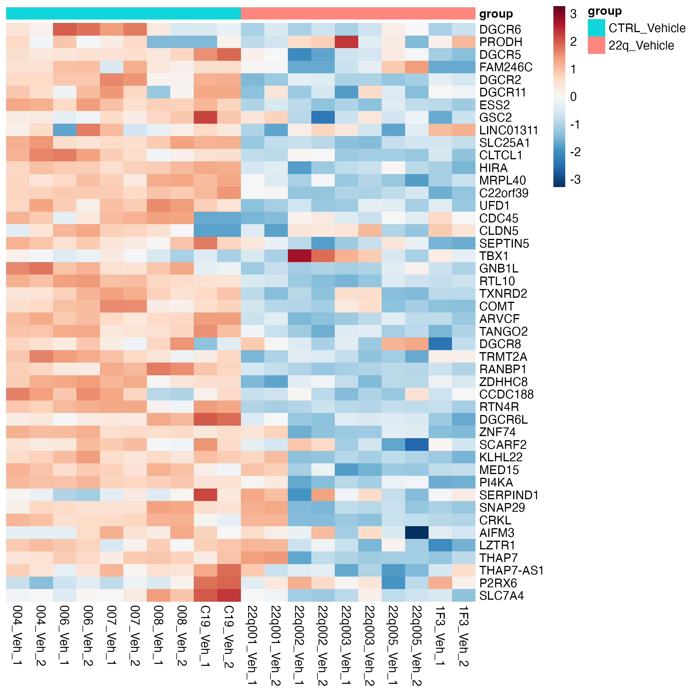
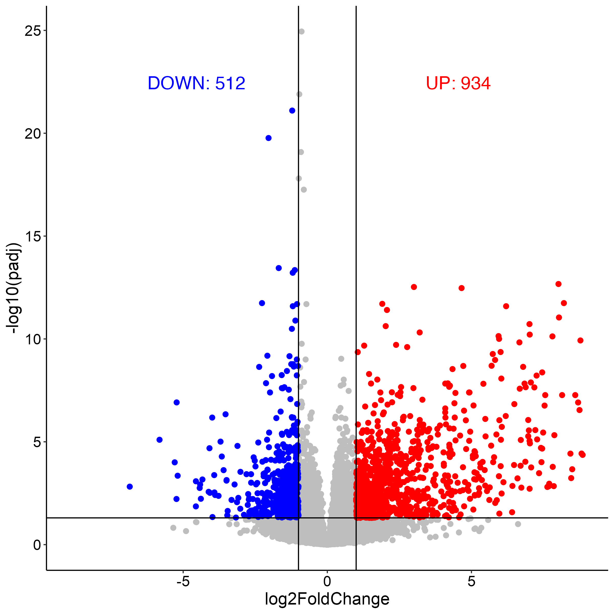
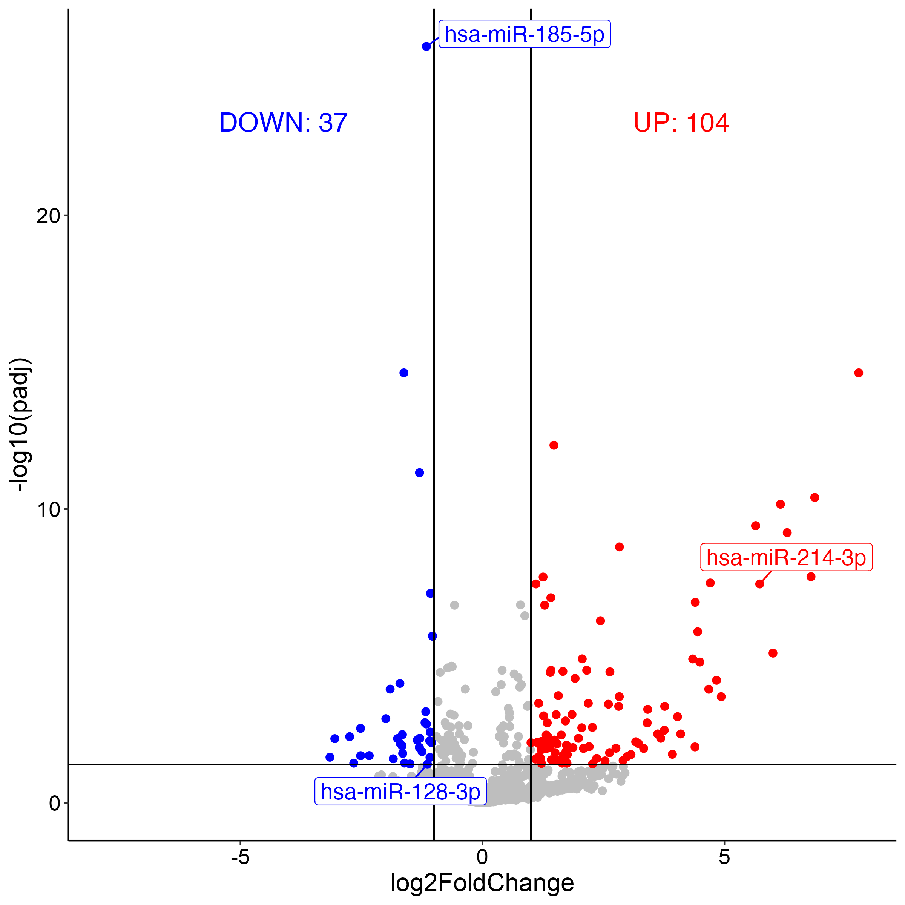

# mutilomics_22q

This repository contains the code and data for the manuscript "".

# Introduction to 22q11.2 deletion syndrome


22q11.2 deletion syndrome (22q11.2DS) is the most common copy number variant (CNV) - associated syndrome, caused by the deletion of a small segment of chromosome 22.

> 22q11.2 deletion syndrome (22q11.2DS) is the most common chromosomal microdeletion disorder, estimated to result mainly from de novo non-homologous meiotic recombination events occurring in approximately 1 in every 1,000 fetuses.
>
> 


Here we list the genes in the 22q11.2 region:


> Schematic representation of the 3-Mb 22q11.2 region that is commonly deleted in 22q11.2 deletion syndrome, including the four low copy repeats (LCR22s) that span this region (LCR22A, LCR22B, LCR22C and LCR22D). Common commercial probes for fluorescence in situ hybridization (FISH) are indicated (N25 and TUPLE). The protein-coding and selected non-coding (*) genes are indicated with respect to their relative position along chromosome 22 (Chr22).


**References:**

McDonald-McGinn, D., Sullivan, K., Marino, B. et al. 22q11.2 deletion syndrome. Nat Rev Dis Primers 1, 15071 (2015). https://doi.org/10.1038/nrdp.2015.71


# File structure
```bash
tree -L 2

.
├── README.md
├── analysis
│   ├── synaptosomes_bulkRNA_analysis
│   ├── synaptosomes_miRNA_anlaysis
│   ├── synaptosomes_miRNA_gene_network
│   └── synaptosomes_scRNA_analysis
├── data
│   ├── neruon_bulkRNA
│   ├── ref
│   ├── synaptosomes_bulkRNA
│   ├── synaptosomes_miRNA
│   └── synaptosomes_scRNA
├── images
│   ├── 22q_gene.png
│   └── 22q_intro.png
├── logs
└── source
    └── DEG_functions.R

15 directories, 4 files
```

# Analysis Results

## 22q missing genes in synaptosomes

We first check the 22q missing genes in the synaptosomes data. The results are shown below:



Notice that almost all 22q missing genes are down-regulated in the synaptosomes data. Except for the sample 22q_001_Veh_2, which is mean it may have a different missing gene pattern.


## Bulk RNA-seq analysis
We do DEG analysis on the bulk RNA-seq data of synaptosomes from 22q11.2 deletion syndrome and control samples under the vehicle condition. The results are shown below:



## Bulk miRNA-seq analysis
We do DEM analysis on the bulk miRNA-seq data of synaptosomes from 22q11.2 deletion syndrome and control samples under the vehicle condition. The results are shown below:




## miRNA-Gene network analysis

We construct the miRNA-gene network based on the DEM and DEG results. The results are shown below:


